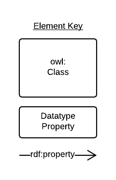
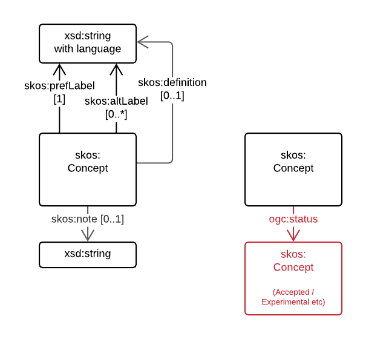

# NVS Vocabulary Profile

## Table of Contents

[Metadata](#metadata)  
[Abstract](#abstract)  
[Namespaces](#namespaces)  
[1. Introduction](#1-introduction)  
[2. Requirements](#2-requirements)  
[3. References](#3-references)  

## Metadata
* **URI**:
    * <https://w3id.org/profile/nvsvoc/specification>
* **Title**:
    * NVS Vocabulary Profile - Specification Document
* **Definition**:
    * This resource described, in human-readable terms, the requirements data must meet to adhere to this Profile
* **Created**:
    * 2020-09-16
* **Modified**:
    * 2020-09-16
* **Creator**:
    * [British Oceanographic Data Centre](https://www.bodc.ac.uk) 
* **Publisher**:
    * [British Oceanographic Data Centre](https://www.bodc.ac.uk) 
* **Further metadata**:
    * This specification document is part of the [NVS Vocabulary Profile](https://w3id.org/profile/nvsvoc). See that profile's main document for License & Rights information and other metadata not given here.
* **Profile URI**:
    * <https://w3id.org/profile/nvsvoc>

## Abstract
This is the specification document of the [BODC](https://www.bodc.ac.uk)'s profile of the *Vocabulary Publications Profile*. It defines, in natural language, the requirements that data must satisfy to be considered conformant with this profile.

This specification is not to be used for testing conformance of RDF resources to this profile. That role belongs to the validation resource within this profile:

* <https://w3id.org/profile/nvsvoc/validation>

For the list of all resources within this profile, see the profile definition:

* <https://w3id.org/profile/nvsvoc>

## Namespaces

* **dcterms**
    * <http://purl.org/dc/terms/>
* **prof**
    * <http://www.w3.org/ns/dx/prof/>
* **prov**
    * <http://www.w3.org/ns/prov#>
* **sdo**
    * <https://schema.org/>
* **skos**
    * <http://www.w3.org/2004/02/skos/core#>
* **rdfs**
    * <http://www.w3.org/2000/01/rdf-schema#> 
* **vocpub**
    * <https://w3id.org/profile/vocpub/>     

### Diagram Key
Diagrams in this Specification use the elements shown in Figure 1.

  
**Figure 1:** Diagram Elements Key

## 1. Introduction
The [British Oceanographic Data Centre (BODC)](https://www.bodc.ac.uk) defines a vocabulary as a controlled collection of defined terms that may or may not contain relationships between terms and relationships to terms in other vocabularies. 

The BODC uses the Simple Knowledge Organization System Reference (SKOS)[SKOS-REF] to structure their vocabularies and properties from a number of other ontologies (DCTERMSDCTERMS, PAVPAV) to describe vocabulary elements and their relations.

This document is a profile of the *Vocabulary Publications Profile*VOC-PUB and by profile, the definition of *Profile* from the Profiles VocabularyPROF is used. A profile is: 

> A specification that constrains, extends, combines, or provides guidance or explanation about the usage of other specifications. 

In the next section, this document describes how vocabulary elements must be presented to conforms to this profile. 

## 2. Requirements

### 2.1 Vocabulary

### 2.2 Concept
From the SKOS PrimerSKOS-PRIMER:

> The fundamental element of the SKOS vocabulary is the concept. Concepts are the units of thought — ideas, meanings, or (categories of) objects and events—which underlie many knowledge organization systems 

NVS vocabulary concepts are `skos:Concept` instances and have SKOS objects and datatype properties as well as properties from several other ontologies.

**2.2.1 Concept URI:** Each vocabulary concept *MUST* be identified by a URI

  
**Figure X:** Concept labels  

**2.2.2 Concept preferred labels:** Each vocabulary concept *MUST* have one and only one `skos:prefLabel` property per language

**2.2.3 Concept labels:** Each vocabulary concept *MAY* have any number of `skos:altLabel` properties and, if it does, the property must indicate its language

**2.2.2 Concept definition:** Each vocabulary concept *MAY* have `skos:definition` properties and, if it does, it may *MUST* only have one per language

### 2.3 Agent

## 3. References
* **PROF**
    * Rob Atkinson; Nicholas J. Car (eds.). *The Profiles Vocabulary*. 18 December 2019. W3C Working Group Note. URL: <https://www.w3.org/TR/dx-prof/>
* **SKOS-REF**
    * Alistair Miles; Sean Bechhofer (eds.). *SKOS Simple Knowledge Organization System Reference*. 18 August 2009. W3C Recommendation. URL: <https://www.w3.org/TR/skos-reference/>
* **SKOS-PRIMER**
    * Antoine Isaac; Ed Summers (eds.). SKOS Simple Knowledge Organization System Primer. 18 August 2009. W3C Note. URL: <https://www.w3.org/TR/skos-primer/>
* **VOC-PUB**
    * SURROUND Australia Pty Ltd. *Vocabulary Publication Profile*. 24th August 2020. Published Profile. URL: <https://w3id.org/profile/vocpub>
